# Tier 2 asks:

- What happened?

- How bad is it?

- What was accessed?

- Was data stolen?

 

**Initial Access**

Phishing Email 

- Attachment: Invoice_20230103.lnk

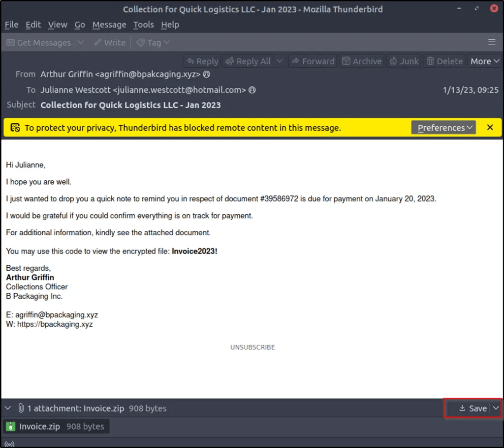

 

Execution

PowerShell Download Cradle

- Domain: files.bpakcaging.xyz

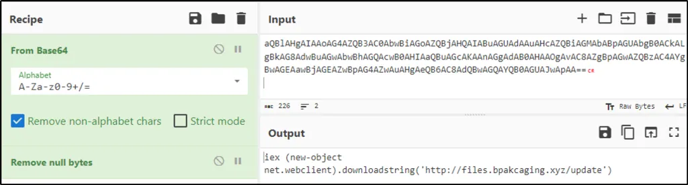

MITRE

- T1566.001 - Phishing

- T1059.001 - PowerShell

 

**Discovery**

Attacker downloaded

- seatbelt.exe

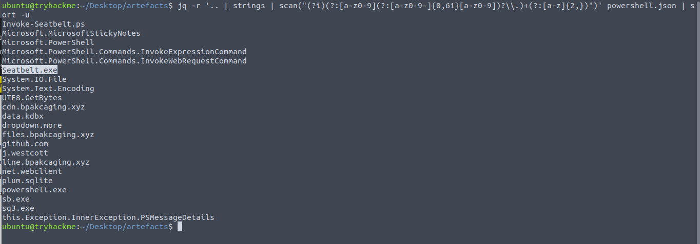

 

Purpose

- Host enumeration

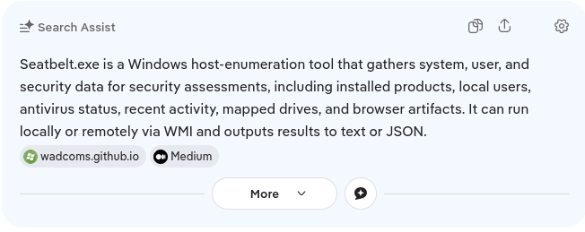

 

MITRE

- T1082 - System Information Discovery

 

**Collection**

Accessed

- C:\Users\j.westcott\AppData\Local\Packages\Microsoft.MicrosoftStickyNotes_8wekyb3d8bbwe\LocalState\plum.sqlite

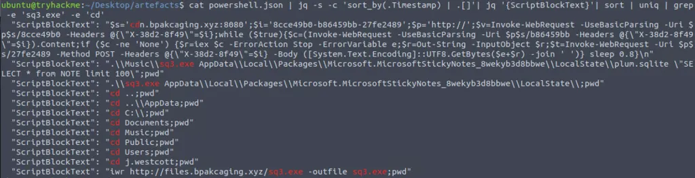

 

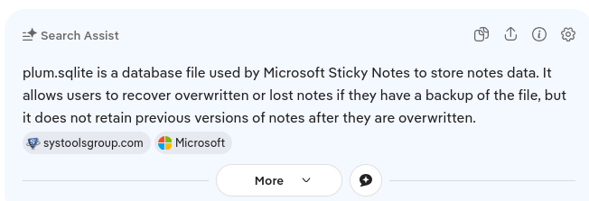

 

Purpose

- Harvest Sticky Notes data

 

**Sensitive Data Collection**

File

- protected_data.kdbx

Type

- KeePass Password Database

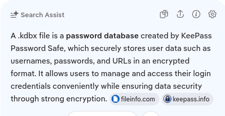

  

**Exfiltration**

Tool

- nslookup

Encoding

- hex

Protocol

- DNS

MITRE

- T1048 - Exfiltration Over Alternative Protocol

- T1071.004 - Application Layer Protocol: DNS

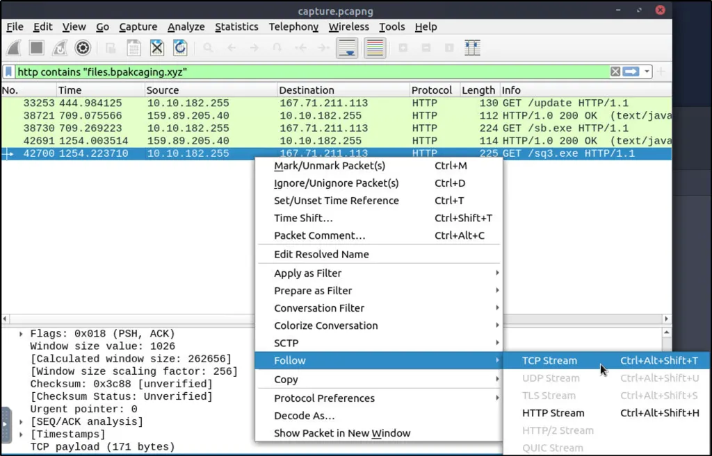

 

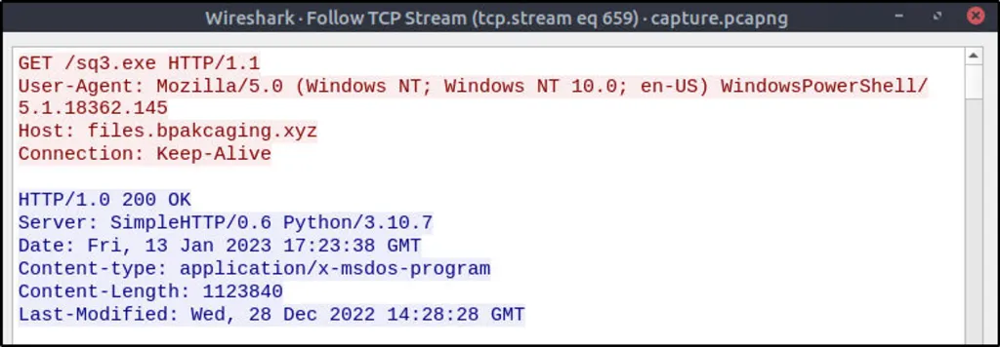

 

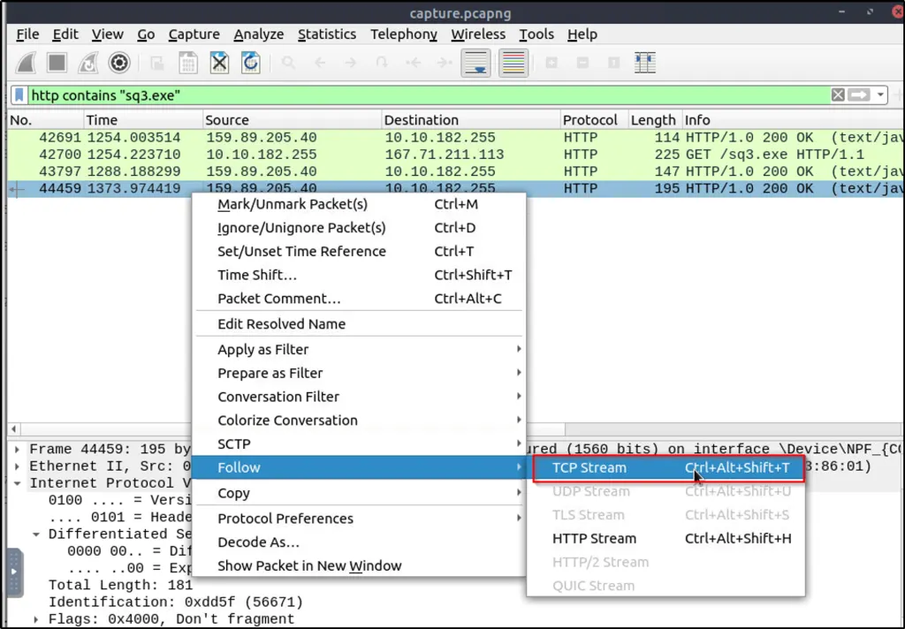

 

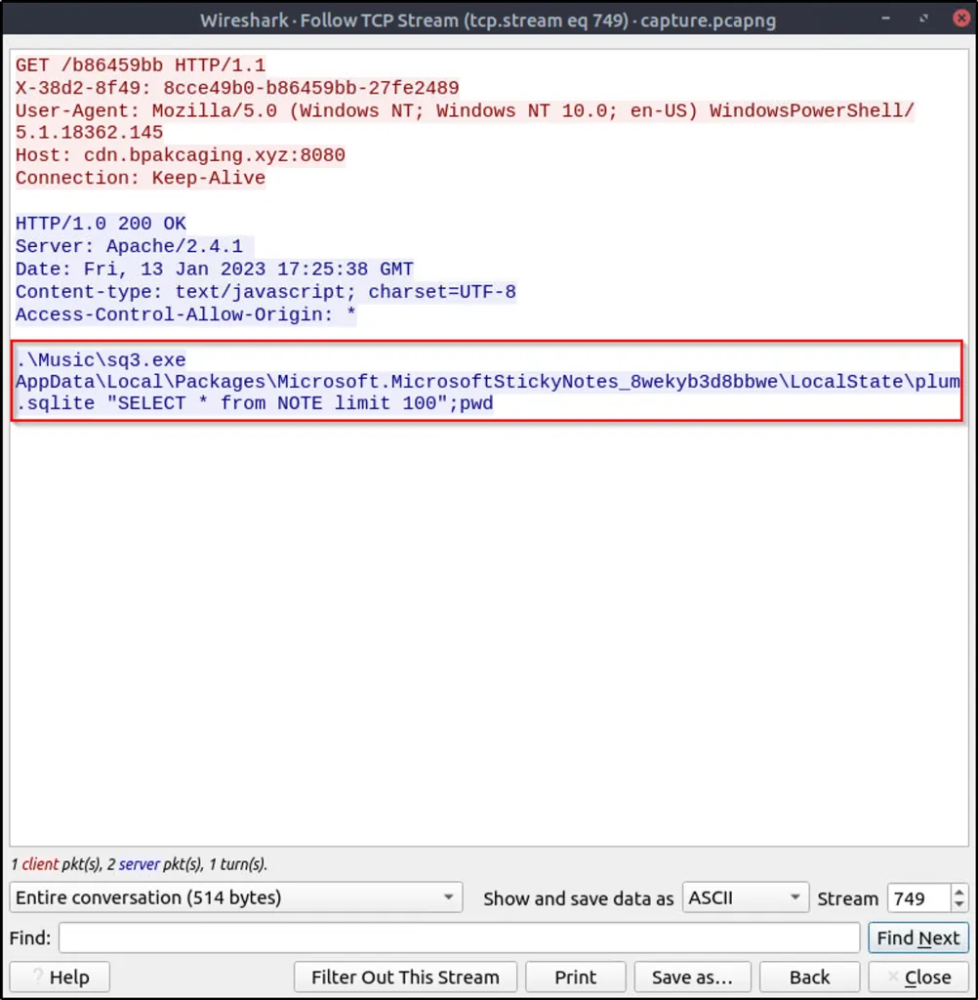

 

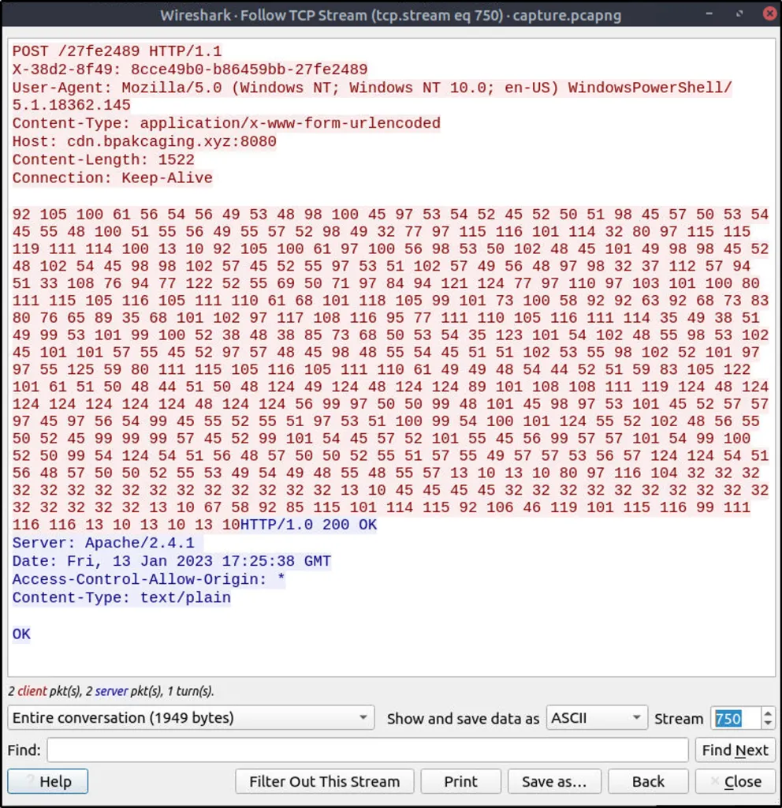

 

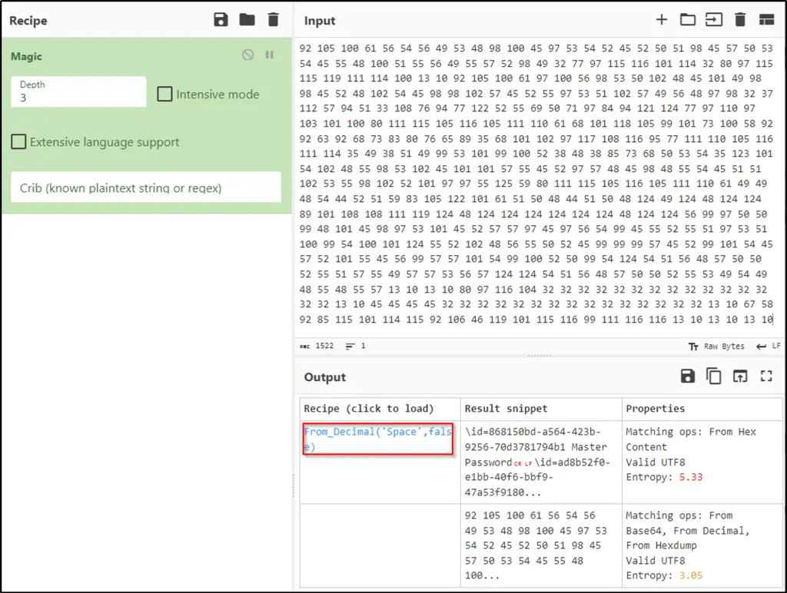

 

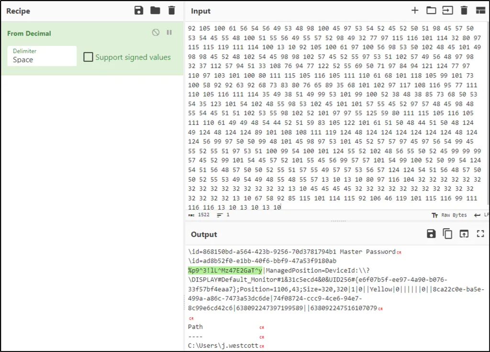

 

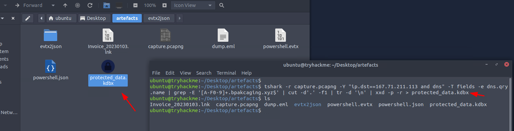

 

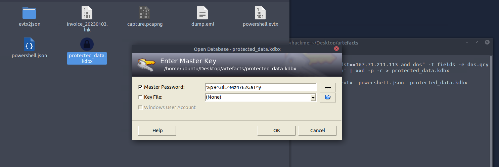

 

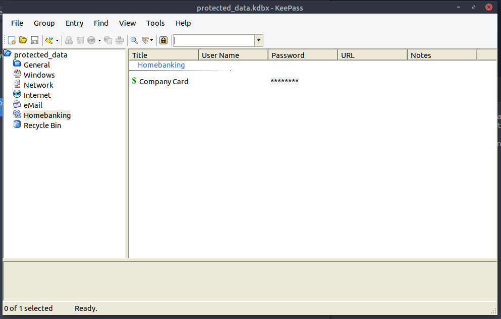

 

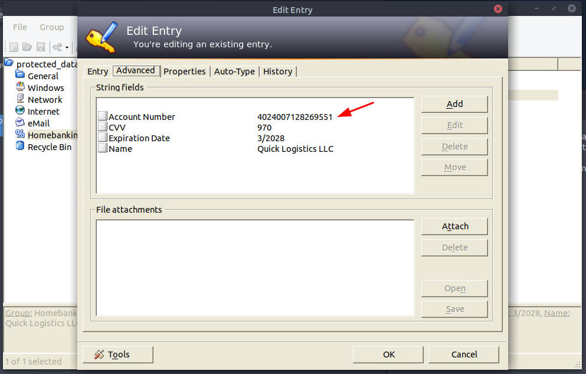

  

## Impact Assessment

Impact:

Sensitive data exposed.

Confirmed access to:

- Sticky Notes database

- KeePass database

Data successfully exfiltrated.

Credit card information recovered from exfiltrated data.

Compromise severity: **HIGH**

  

## Tier 2 Recommendations

- Isolate workstation.

- Reset all credentials stored in KeePass.

- Notify financial institution.

- Block attacker infrastructure.

- Review neighboring endpoints.

- Review DNS logs enterprise-wide.

